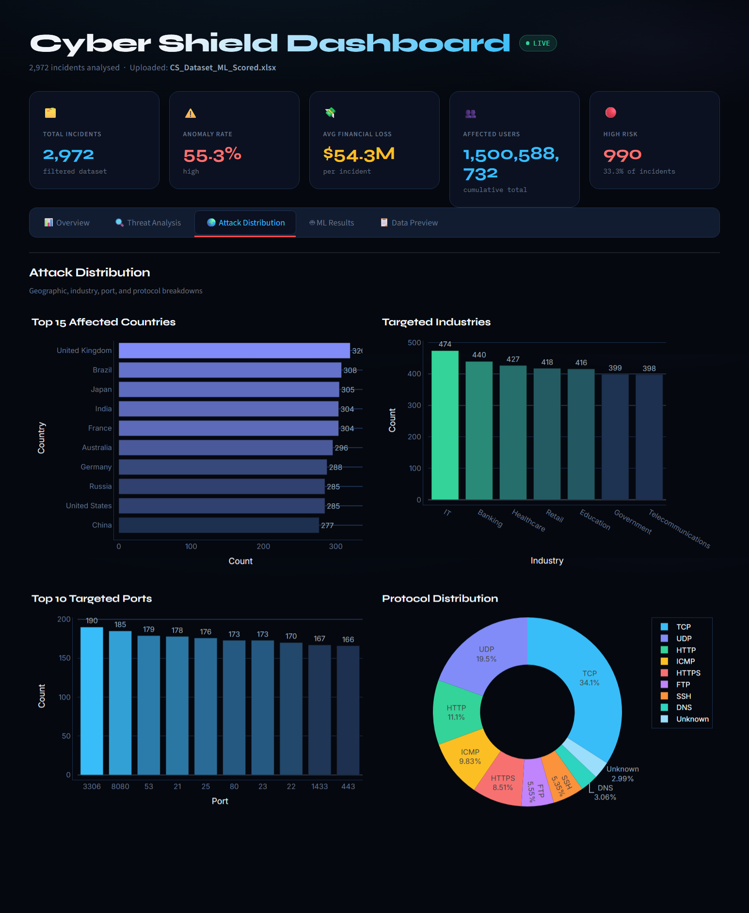
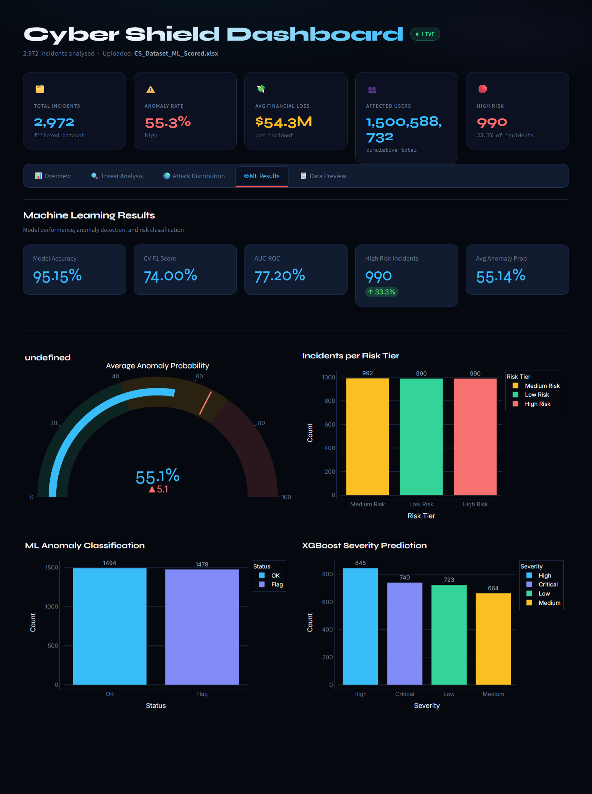
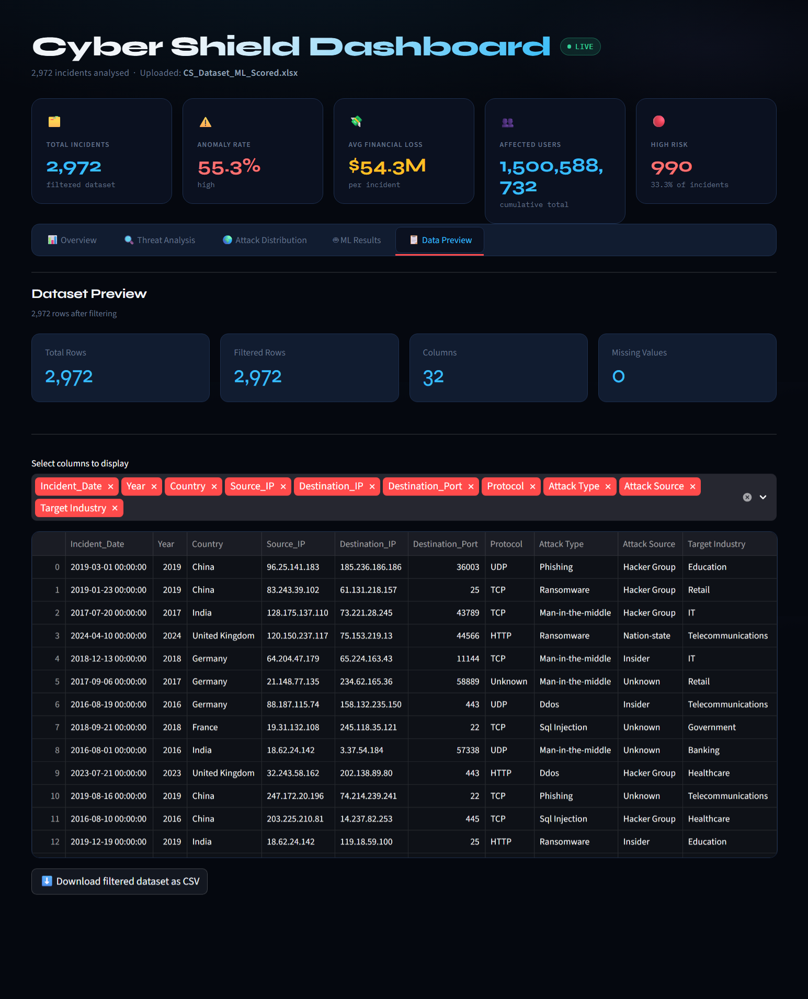

# 🛡️ Cybersecurity Threat Intelligence & Risk Analytics System

<p align="center">
  
  
  
  
</p>

<p align="center">
  AI-powered cybersecurity analytics platform using Machine Learning and Streamlit.
</p>


---

## 🚀 Features

- 🔍 **Threat Classification** — Detect and classify incoming threats using ML models  
- 🚨 **Anomaly Detection** — Identify unusual patterns in network behavior  
- ⚠️ **Severity Prediction** — Predict risk levels before damage occurs  
- 📊 **Interactive Dashboard** — Real-time analytics with Plotly & Streamlit  

---

## 🛠️ Tech Stack

| Tool | Purpose |
|------|---------|
| Python | Core language |
| Streamlit | Web dashboard |
| XGBoost | Threat classification model |
| SHAP | Model explainability |
| Plotly | Interactive charts |

---

## 📸 Screenshots

### 🖥️Overview
<p align="center">
  
</p>

### 🔍 Threat Analysis
<p align="center">
 
</p>

### 📊 Attack Distribution
<p align="center">
  
</p>

### 🚨 ML Results
<p align="center">
  
</p>

### 📈 Data Preview
<p align="center">
 
</p>

---

## ⚙️ Installation

```bash
git clone https://github.com/your-username/cyber-shield.git
cd cyber-shield
pip install -r requirements.txt
streamlit run app.py
```

---

## 📁 Project Structure

```
cyber-shield/
├── app.py
├── model/
├── assets/
│   ├── dashboard_main.png
│   ├── screenshot_1.png
│   ├── screenshot_2.png
│   ├── screenshot_3.png
│   ├── screenshot_4.png
│   └── screenshot_5.png
└── requirements.txt
```
